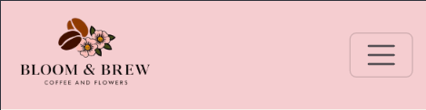

# Bloom and Brew

Bloom and Brew is a full-stack e-commerce website built with Django. It sells fresh flower bouquets and artisan coffee, as well as gift bundles that combine both. Users can browse products, search by keyword or category, and place secure online orders through a simple checkout process.

The live link can be found here - [Bloom and Brew](https://bloom-and-brew-2265123bf17d.herokuapp.com/)

## Table of Contents

## Agile Development- Epics and User Stories
This project was managed using a GitHub Kanban Project board with Epics and User Stories.
Link: [Kanban Board](https://github.com/users/Amelia5p/projects/8)

## EPIC 1: E-commerce & Payments
### User Stories:

#### #1 User Story: Browse Products
As a user I want to browse all products so that I can choose what to purchase.

#### #2 User Story: View Product Detail
As a user I want to view the details of a product so that I can make an informed purchase decision.

#### #3 User Story: Add Items to Cart
As a user I want to add items to a cart so that I can buy multiple things in one checkout.

#### #4 User Story: Checkout with Stripe
As a user I want to pay for my order using Stripe so that I can complete my purchase securely.

#### #5 User Story: View Past Orders
As a user I want to view my previous orders so that I can track what I’ve purchased.

#### #6 User Story: Create Products (Admin)
As an admin I want to create new products so that I can update the store with new inventory.

#### #7 User Story: Update or Delete Products (Admin)
As an admin I want to edit or remove existing products so that I can manage inventory changes.

## EPIC 2: UX Design & Front-End
### User Stories:

#### #8 User Story: User-Friendly Layout
As a user I want to navigate easily on mobile and desktop so that I can shop from any device.

#### #9 User Story: Feedback Messages
As a user I want to see clear messages when actions succeed or fail so that I understand what happened.

#### #10 User Story: Simple Admin UI
As an admin I want a simple interface so that I can manage content without confusion.

#### #17 User Story: View Custom 404 Page
As a user I want to see a helpful 404 page when I visit a broken link so that I’m not confused and I'm redirected easily.

#### #16 User Story: Understand the Site Purpose
As a user I want to understand what the site is selling so that I can decide if it's relevant to me.

## EPIC 3: Marketing Tools
### User Stories:

#### #14 User Story: Subscribe to Newsletter
As a user I want to sign up for the newsletter so that I can receive news and offers.

#### #15 User Story: View Facebook Page
As a user I want to view the Facebook business page so that I can connect with the brand.

## EPIC 4: Authentication & Role Based Access 
### User Stories:

####  #11 User Story: Register and Login
As a user I want to create an account and log in so that I can view my orders.

####  #12 User Story: Admin Access
As an admin I want to access a private page so that I can manage products securely.

## Business Plan and Marketing Strategy

View Business Plan and Marketing Strategy

 

  
  

## Design

#### Colour Scheme

This particular colour scheme was chosen to reflect the calm and earthy feel of the brand. The soft tones of Tea Green , Misty Rose, and Isabelline create a light, fresh look suitable for flowers and gift products. The richer shades of Beaver and Rose Ebony add warmth and depth, helping to balance the overall design — especially for the coffee product pages.

#### Imagery

The product shots were created using Photo Recreator AI. Other images used were sourced from Pexels free images.

#### Fonts

The site uses two main fonts to support brand personality and readability:

Playfair Display is used for headings. It gives the site an elegant and refined look, which suits the flower and gift elements of the brand.

Poppins is used for body text. Its clean, modern style makes content easy to read across all screen sizes.

#### Wireframes
Wireframes were created at the start of the project to plan the layout, structure, and user flow before development. This helped ensure a consistent design and smooth user experience across all pages.

View Wireframes

 

## Features

### Navigation Bar

- The navigation at the top of each page provides easy access to all main sections of the website.

### Footer

- The footer is at the bottom of each page and contains social links. I made sure these links opened in another tab to prevent users from being driven away from the site.

### Home Page

#### Hero section
- Purpose of the site is revealed right away. Eye-catching image and introduction text help set the tone and guide the user into the site.

#### Bundles and Newsletter
- Highlights bundle deals and encourages users to sign up for the newsletter.

#### Featured Picks
- Shows selected popular or seasonal items on the homepage to catch user interest.

#### CTA
- A clear call-to-action encouraging users to start shopping right away.

### Shop All Products
- Displays the full range of available products with filters and search functionality.

### Shop Blooms
- Displays all flower-related products.

### Shop Brews
- Displays all coffee-related products.

### Shop Bundles
- Combines flowers and coffee into curated gift bundles.

### Shopping Cart
- Lets the user view, update, or remove items before checking out.

### Order Success
- Confirms the order has been placed and thanks the user.

### My Orders/ Order History
- Shows a summary of all previous orders made by the user.

### About Us/ Contact Us
- Introduces the brand and gives context about the company and its value, contact information provided also.

### Profile
- Users can view and manage their saved details here.

### Sign Up
- When a user signs up, a profile is automatically created for them, the user can add to and edit the profile.

### Log In Page/ Success
-Allows existing users to log in and confirms successful login.

### Log Out Page/ Success
- Confirms successful logout and ends the user session.

### Error pages
- Custom 404 page shown when a user tries to access a page that doesn't exist.

### Success Messages
- Success messages are shown on every action made by the user.

### Newsletter
- The User can sign up to receive the newsletter easily on the landing page.

## Future Features

In the future I would like to add the following features to further improve the site:

## CRUD Functionality

- User's can Create, Read, Update and Delete both their cart and their profile information.

## Data Model
- The data models for the project are shown below. 

### Checkout App
#### Order

- Description: Represents a customer's order including personal details, payment info, and address.

`order_number:` A unique identifier for the order, generated automatically.

`reference_code:` A second unique identifier used for tracking or verification.

`user:` ForeignKey to the UserProfile model, representing the user who placed the order.

`full_name:` Full name of the customer.

`email_address:` Customer's email address.

`contact_number:` Phone number of the customer.

`address_line_1:` First line of the shipping address.

`address_line_2:` Second line of the shipping address (optional).

`town:` Town or city of the shipping address.

`county:` County of the shipping address.

`postal_code:` Postal or ZIP code.

`country:` Country selected using Django Countries.

`created_on:` Timestamp when the order was created.

`subtotal:` The subtotal cost of all items before delivery.

`delivery_fee:` Delivery charge, waived for orders over €50.

`total_due:` The final total amount to be paid.

`cart_snapshot:` Text snapshot of the cart contents at the time of order.

`stripe_pid:` Stripe PaymentIntent ID for reference.

#### OrderItem

- Description: Represents an individual item within an order.

`order:` ForeignKey to the Order model the item belongs to.

`product:` ForeignKey to the Product model for the purchased item.

`quantity:` Number of units ordered for that product.

`item_total:` Total price for this item (product price × quantity), calculated automatically.

### Products App
#### Product

- Description: Represents items available for sale in the store, including bouquets, coffee, and gift bundles.

`name:` Name of the product.

`sku:` A unique stock keeping unit for internal reference.

`description:` A detailed description of the product.

`category:` The product type – bouquet, coffee, or bundle.

`price:` Standard selling price of the product.

`special_offer_price:` Optional discounted price if on special offer.

`image:` Product image stored via Cloudinary.

`stock:` Quantity of the item available in inventory.

`slug:` URL-friendly version of the product name, generated automatically.

`is_featured:` Marks the product to be shown in the "Featured Picks" section.

`bundle_of_the_week:` Highlights a product as the weekly featured bundle.

#### Review
- Description: Stores user-submitted reviews, including star rating and optional written feedback.

`product:` ForeignKey to the Product being reviewed.

`user:` ForeignKey to the User who wrote the review.

`rating:` Star rating from 1 to 5.

`comment:` Optional written comment left by the user.

`created_on:` Timestamp of when the review was submitted.

Reviews are ordered with the newest first and a user can only leave one review per product.

### Profiles App
#### UserProfile

- Description: Stores additional information about each user, such as saved shipping details and contact number. Automatically created or updated when a User is saved.

`user:` One-to-one relationship with Django's built-in User model.

`phone:` Optional phone number for contact.

`address_1:` First line of the user's saved address.

`address_2:` Second line of the address (optional).

`city:` City or town name.

`county:` County name.

`country:` Country field using django-countries.

`postcode:` Postal or ZIP code.

The profile is created automatically when a new user is registered, using Django signals.

## Testing

### HTML

HTML was passed through the W3C validator with no errors.

| Page                   | Result     |
|------------------------|------------|
| base.html              | No errors  |
| home.html              | No errors  |
| about.html             | No errors  |
| add-product.html       | No errors  |
| add-review.html        | No errors  |
| delete_product.html    | No errors  |
| delete_review.html     | No errors  |
| edit_product.html      | No errors  |
| edit_review.html       | No errors  |
| manage_products.html   | No errors  |
| product_detail.html    | No errors  |
| product_list.html      | No errors  |
| shop_blooms.html       | No errors  |
| shop_brews.html        | No errors  |
| shop_bundles.html      | No errors  |
| cart.html              | No errors  |
| checkout_success.html  | No errors  |
| checkout.html          | No errors  |
| order_history.html     | No errors  |
| edit_profile.html      | No errors  |
| profile.html           | No errors  |
| login.html             | No errors  |
| signup.html            | No errors  |
| 404.html               | No errors  |
| 500.html               | No errors  |

### CSS

CSS was passed through W3C validator with no errors.

### JavaScript

JavaScript was passed through JShint with no errors.

### Python

Python code was passed through the PEP8 CI linter with no errors.

## General Testing

| Test             | Action                                                                 | Success Criteria                                                 |
| --------------- | ---------------------------------------------------------------------- | ---------------------------------------------------------------- |
| **Homepage loads**  | Navigate to website URL                                            | Page loads with no errors                     |
| **Links**          | Click on each navigation link, CTAs, buttons, logo, and footer links  | Correct page loads or correct action performed, new tab opens if applicable |
| **Form validation** | Enter data into each input field, ensuring only valid data is accepted  | Form does not submit until correct data is entered, and an error message is shown |
| **Responsiveness**  | Resize viewport window from 320px upwards using Chrome DevTools. Test various devices  | Page layout remains intact and adapts correctly to different screen sizes |

### Lighthouse

Lighthouse validation was run on all pages (both mobile and desktop).  Here are the scores: 

| Page           | Performance  | Accessibility | Best Practices  | SEO |
|----------------|:------------:|:-------------:|:---------------:|:---:|
|                |              |               |                 |     |
| Home           |          97  |           98  |             100 | 100 |
| My Trips       |          98  |           98  |             100 | 100 |
| Trip Details   |          99  |           98  |             100 | 100 |
| Delete trip*   |          99  |           98  |             100 | 100 |
| Create trip*   |          99  |           98  |             100 | 100 |
|SuggestActivity |          100 |           100 |             100 | 100 |
| Delete Trip    |          100 |           100 |             100 | 90  |
| Edit Trip      |          90  |           100 |             100 | 100 |
|All Trips(admin)|          89  |           98  |             100 | 90  |
| Profile        |          98  |           98  |             100 | 100 |
| Login          |          99  |           99  |             100 | 100 |
| Signup         |          100 |           99  |             100 | 100 |
| Edit Profile   |          98  |           100 |             100 | 100 |
| Delete Profile |          98  |           100 |             100 | 91  |

## Browser Testing
The Website was tested on Google Chrome, Firefox, Safari browsers with no issues.

## Security Features

### User Authentication
Authorisation is required to reach certain pages such as . Requesting these pages while unauthorised will redirect users to the Login page.

### Form Validation
Incorrect or in certain cases empty data in forms is not accepted and the user is made aware.

### Database Security
The database url and secret key are stored in the .env file to prevent unwanted connections.

Cross-Site Request Forgery (CSRF) tokens were used on all forms throughout this site.

## Deployment - Heroku

To deploy this page to Heroku from its GitHub repository, the following steps were taken:

1. Login to the Heroku dashboard and create a new app.
2. Connect your GitHub repository to your Heroku app.
3. Set environment variables in the Config Vars section of the Settings tab.
4. In the Deploy tab, enable automatic deploys from your GitHub repository.
5. Click the "Deploy Branch" button to deploy the app.
6. Once the app has been deployed, click the "Open App" button to view the app.

-  Under 'Config Vars' the following variables to be set:

    - `DATABASE_URL` - the URL for your Postgres database.
    - `NAME` - the name of your database.
    - `USER` - the username for your database.
    - `PASSWORD` - the password for your database.
    - `HOST` - the host for your database.
    - `PORT` - the port for your database.
    - Django settings:
    - `SECRET_KEY` - the secret key for your Django project. (kept in .env file)
    - `DEBUG` - set to `True` for development, `False` for production.

## Cloning Repository

### <ins> Step 1: </ins>

From the <a href="https://github.com/Amelia5p/travel-planner" target="_blank">GitHub repository</a> click on the 'code' button.

### <ins> Step 2:</ins>

Click 'local' on the top of the drop down menu and copy the URL.

### <ins>Step 3: </ins>

Open Git Bash on windows and change the working directory to the location where you want the cloned directory.

### <ins>Step 4: </ins>

Type 'Git clone' followed by a space and paste the URL previously copied, hit enter.

### <ins> Result: </ins> 

You now have a local copy of the Github repository.

## Forking Repository

### <ins>Step 1:</ins>

From the <a href="https://github.com/Amelia5p/travel-planner" target="_blank">GitHub repository</a> click on the 'fork' button in the top right corner of the page. 

### <ins>Step 2:</ins> 

Choose to copy only the main branch or all branches to the new fork.

### <ins>Step 3: </ins>

Click Create a Fork.

### <ins>Result:</ins>

There is now a forked copy on GitHub.

## Languages

- Python
- HTML
- CSS
- Javascript

### Programs used
- [Django](https://www.djangoproject.com/): main python framework used in the development of this project.
- [Heroku](https://dashboard.heroku.com/login) - used as the cloud based platform to deploy the site on.
- [Balsamiq](https://balsamiq.com/) - used to generate Wireframe images.
- [Chrome Dev Tools](https://developer.chrome.com/docs/devtools/) - used for overall development and testing.
- [Font Awesome](https://fontawesome.com/) - used for icons.
- [GitHub](https://github.com/) - used for agile tool.
- [Google Fonts](https://fonts.google.com/) - used to import fonts.
- [W3C](https://www.w3.org/) - used for HTML & CSS Validation.
- [PEP8 CI Linter](https://pep8ci.herokuapp.com/) - used to validate all the Python code.
- [Jshint](https://jshint.com/) - used to validate javascript.
- [Favicon](https://favicon.io/) - used to create the favicon.
- [Mermaid](https://mermaid.live/) - used to create the database schema design
- [Bootstrap 5](https://getbootstrap.com/docs/5.0/):Framework for developing responsiveness and styling
- [Am I responsive](https://ui.dev/amiresponsive) used for responsive picture
- [Coolors](https://coolors.co/) used for creating colour palette

## Bugs

- Some users do not have a Profile associated with them- fixed by using django signals to auto make profile when sign up.

## Credits
- [Code Institute - Walkthrough Project](https://github.com/Code-Institute-Solutions/boutique_ado_v1_sourcecode)

## Acknowledgements 
This is the fifth and final project, created for the Code Institutes Full Stack Web Developer (eCommerce) course. I would like to thank my cohort facilitator and the Code Institute team for their support.